# hse_hw3_chromhmm
# [Сolab](https://colab.research.google.com/drive/1R7uXkOoaBvqCCnr1lh-QlS1y5Xz816UN#scrollTo=k80uGrS5quq1)
# Часть 1

Клеточная линия, рассматриваемая в Дз2 (IMR-90), не содержит ChIP-seq эксперименты в рассматриваемых гистоновых метках
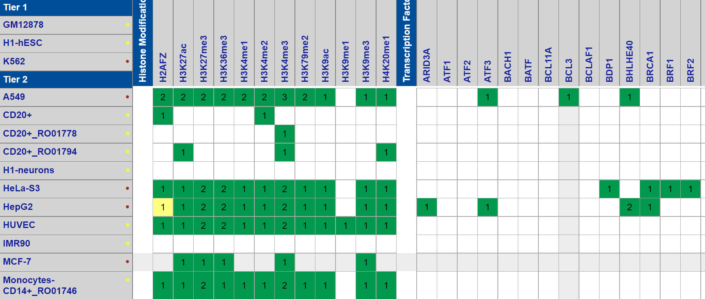

Из за этого, будем рассматривать в данном дз HepG2.

## Список гистоновых меток

| Гистоновая метка | Ссылка |
|------------------|--------|
|   H2AFZ          |    http://hgdownload.cse.ucsc.edu/goldenPath/hg19/encodeDCC/wgEncodeBroadHistone/wgEncodeBroadHistoneHepg2H2azStdAlnRep1.bam    |
|   H3K4me1        |    http://hgdownload.cse.ucsc.edu/goldenPath/hg19/encodeDCC/wgEncodeBroadHistone/wgEncodeBroadHistoneHepg2H3k04me1StdAlnRep1.bam    |
|   H3K9me3        |    http://hgdownload.cse.ucsc.edu/goldenPath/hg19/encodeDCC/wgEncodeBroadHistone/wgEncodeBroadHistoneHepg2H3k09me3AlnRep1.bam    |
|   H3K4me2        |    http://hgdownload.cse.ucsc.edu/goldenPath/hg19/encodeDCC/wgEncodeBroadHistone/wgEncodeBroadHistoneHepg2H3k4me2StdAlnRep1.bam    |
|   H3K9ac         |    http://hgdownload.cse.ucsc.edu/goldenPath/hg19/encodeDCC/wgEncodeBroadHistone/wgEncodeBroadHistoneHepg2H3k9acStdAlnRep1.bam    |
|   H3K27ac        |    http://hgdownload.cse.ucsc.edu/goldenPath/hg19/encodeDCC/wgEncodeBroadHistone/wgEncodeBroadHistoneHepg2H3k27acStdAlnRep1.bam    |
|   H3K36me3       |    http://hgdownload.cse.ucsc.edu/goldenPath/hg19/encodeDCC/wgEncodeBroadHistone/wgEncodeBroadHistoneHepg2H3k36me3StdAlnRep1.bam    |
|   H3K79me2       |    http://hgdownload.cse.ucsc.edu/goldenPath/hg19/encodeDCC/wgEncodeBroadHistone/wgEncodeBroadHistoneHepg2H3k79me2StdAlnRep1.bam    |
|   H4K20me1       |    http://hgdownload.cse.ucsc.edu/goldenPath/hg19/encodeDCC/wgEncodeBroadHistone/wgEncodeBroadHistoneHepg2H4k20me1StdAlnRep1.bam    |
|   H3K27me3       |    http://hgdownload.cse.ucsc.edu/goldenPath/hg19/encodeDCC/wgEncodeBroadHistone/wgEncodeBroadHistoneHepg2H3k27me3StdAlnRep1.bam    |

## cellmarkfiletable.txt

[Файл](./cellmarkfiletable.txt)

## Данные
[Папка с выдачей](https://github.com/NikitaGubanov0/hw_3_chromhmm/tree/main/ChromHMM)
(в папке присутсвует не все данные, так как некоторые файлы были слишком большими)
| |  |
|------------------|--------|
|   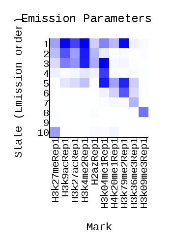    |    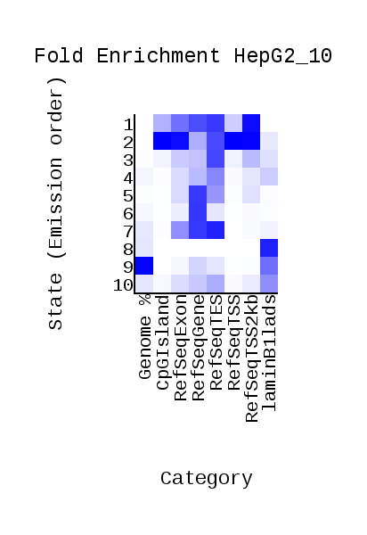 |
|   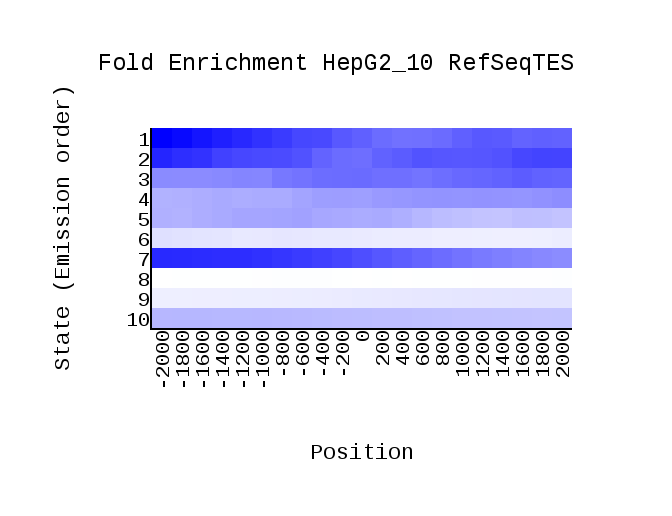       |  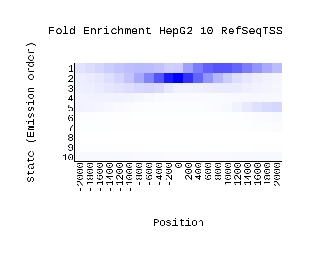   |
| 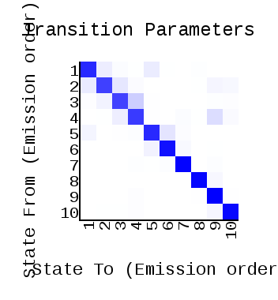||


### Таблицами с этигетическими типы и их свойствами находится в самом низе, так как были проблемы с форматированием

 

## Визуализация с помощью USCC
### Promoter
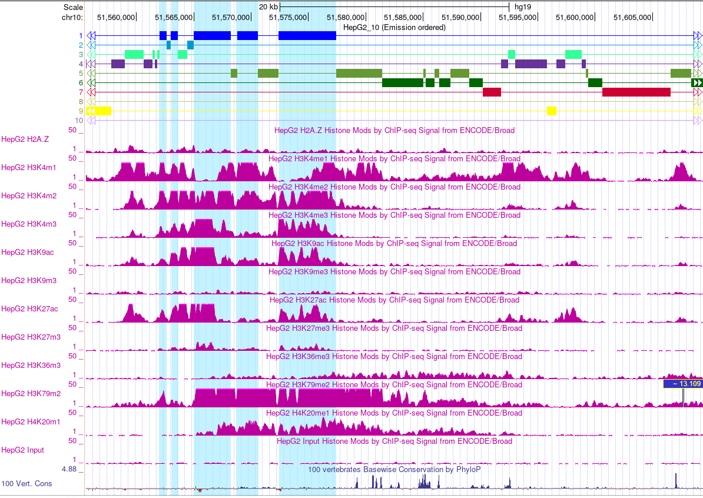
### Enhancer
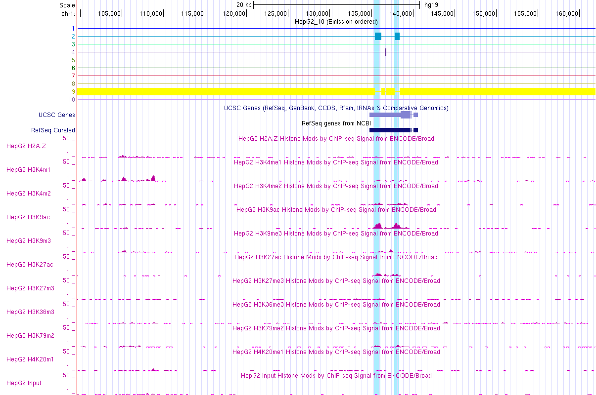 
### Enhancer 
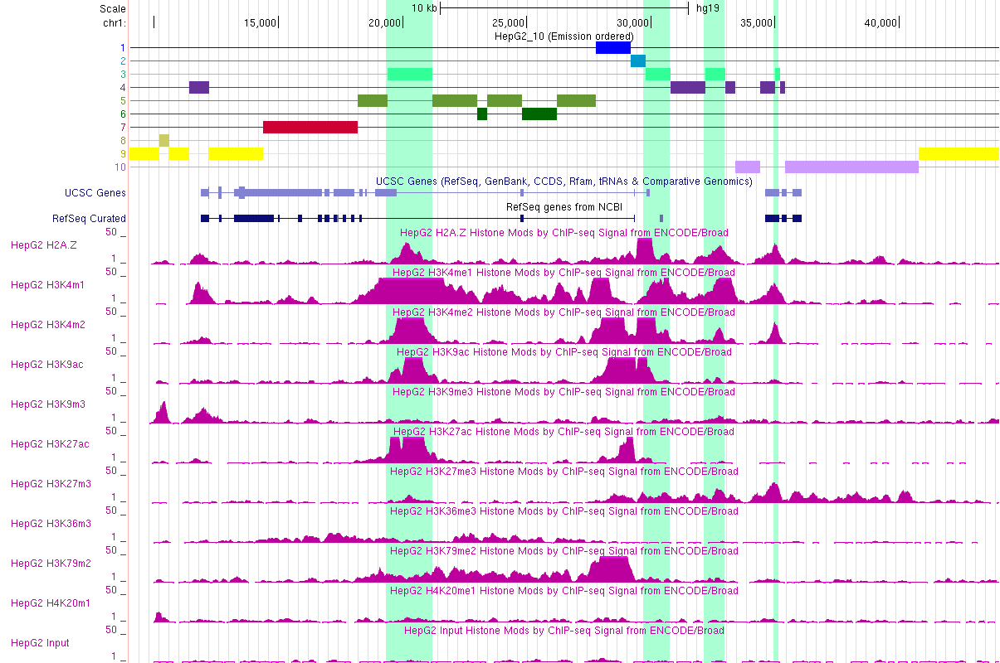 
### Repressed
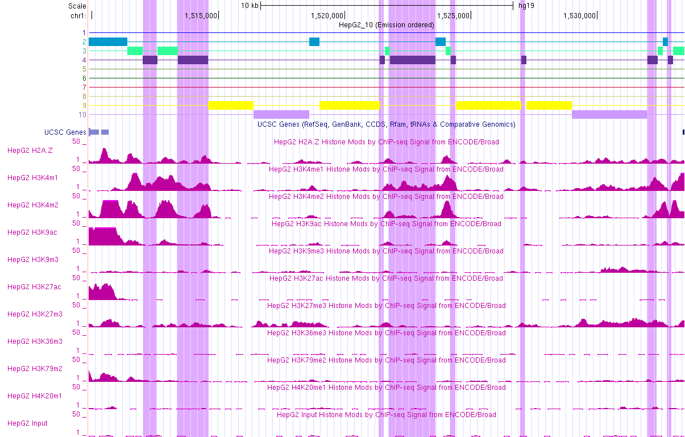 
### Enhancer
 
### PHeterochromatin
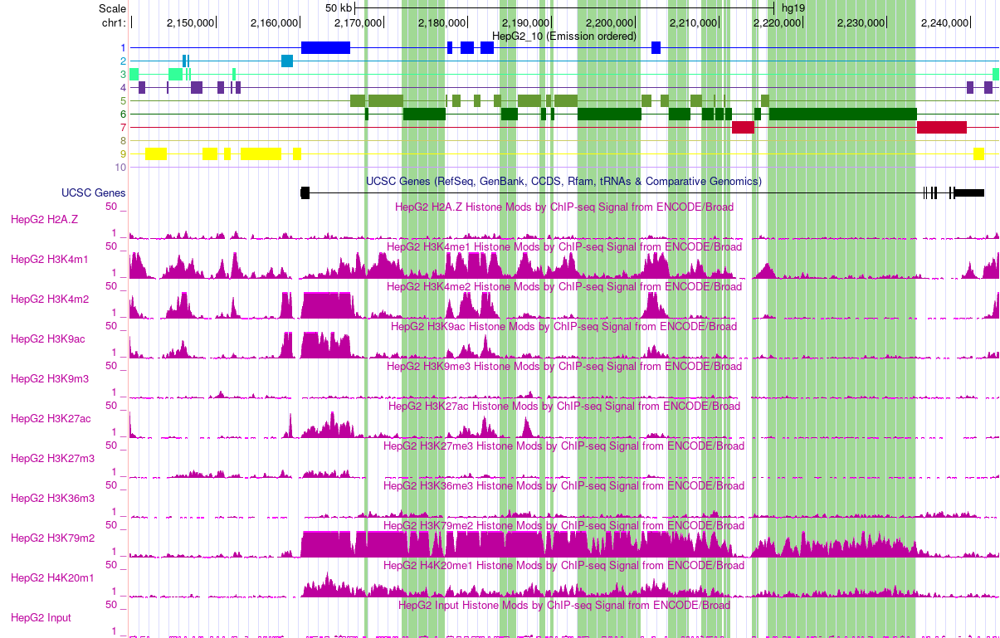 
### Transcribed
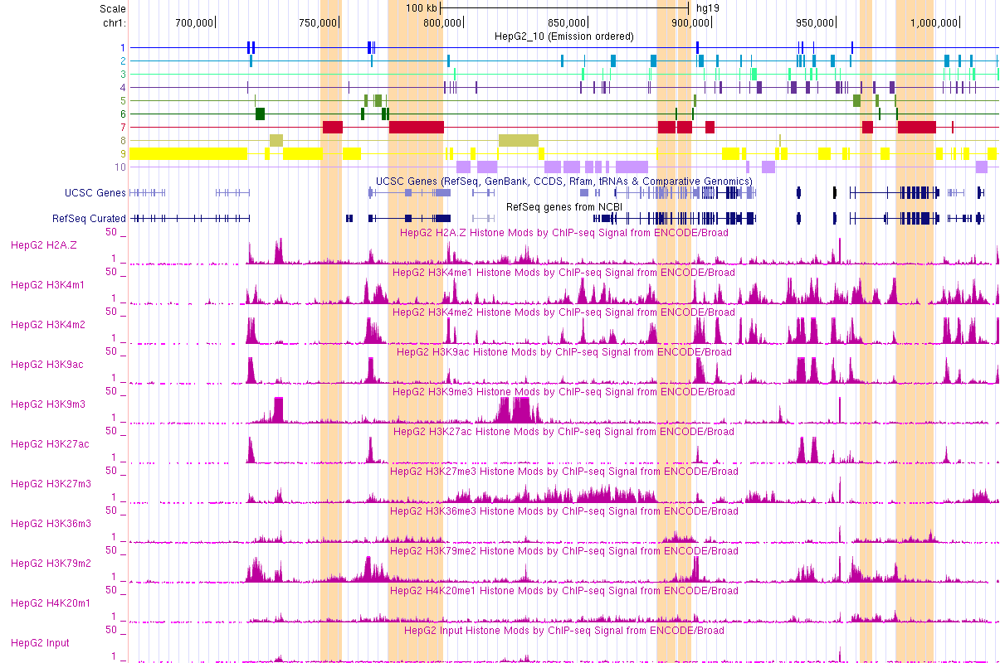 
### Repressed
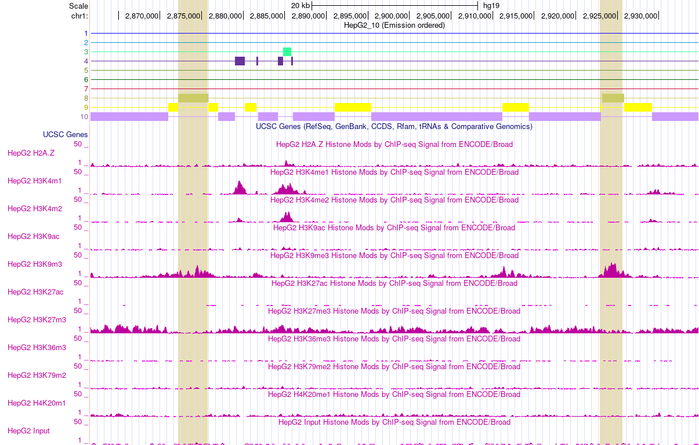 
### Repressed
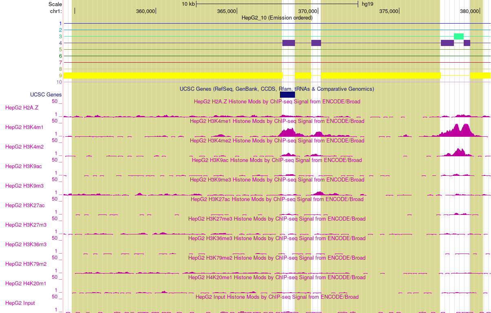 
### Repressed
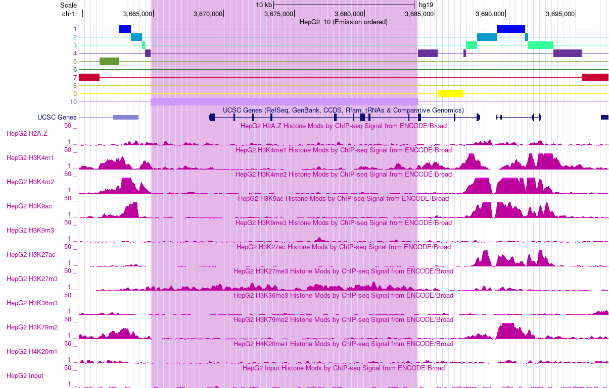 


#  Часть 2
  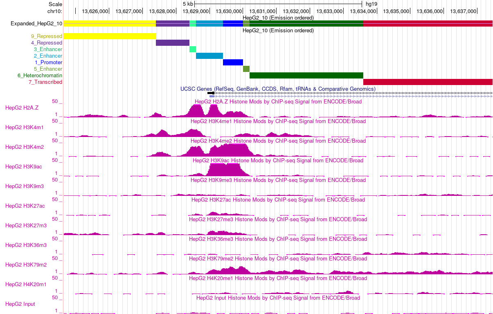 
# Список всех запущенных команд
  ### Создание файла cellmarkfiletable.txt
  ```
  import os
arr = list()

path = '/content/'
control = 'ControlRep1.bam'
cell_type = 'HepG2'

with open(f'{path}cellmarkfiletable.txt', 'a') as the_file:
  for file in os.listdir(path):
    if file[-3:]=='bam' and not file.startswith('Control'):
      s = f'{cell_type}\t{file.split(".")[0]}\t{file}\t{control}\n'
      the_file.write(s)
  ```
 ###  Binarize Bam
```
  !java -mx5000M -jar /content/ChromHMM/ChromHMM.jar BinarizeBam -b 200  /content/ChromHMM/CHROMSIZES/hg19.txt /content/ cellmarkfiletable.txt   binarizedData
  ```
  ### Learn Module
  ```
  !java -mx5000M -jar /content/ChromHMM/ChromHMM.jar LearnModel  -b 200 /content/binarizedData/ /content/learnData 10 hg19
  ```
  ### Для части 2
  ```
types = ['Promoter', 'Enhancer', 'Enhancer', 'Repressed', 'Enhancer',  'Heterochromatin', 'Transcribed', 'Repressed',
         'Repressed', 'Repressed']

with open(f'/content/learnData/HepG2_10_dense.bed', 'r') as f:
  with open(f'/content/learnData/HepG2_10_dense_new.bed', 'a') as f_new:
    lines = f.readlines()
    flag = True
    for line in lines:
      if flag:
        flag = False
        f_new.write(line)
      else:
        arr = line.split('\t')
        arr[3] = arr[3]+'_'+types[int(arr[3])-1]
        f_new.write('\t'.join(arr))
  ```

 
 ## Таблица. Эпигетические типы

| Эпигенетический тип |Встречаемость в гистоновых модификациях| Описание |
|----------|------|----------|
|  Promoter |  во всех, но чаще всего: <ul><li> H3K4me1 <li> H3K4me2 <li> H3K4me3 <li> H3K9ac <li> H3K27ac <li> H3K79me2  | <li> Данное состояние попадает на экзон <li> Показывает высокий сигнал <li> Чаще всего ассоциировано с <ul><li> RefSeqExon <li> RefSeqGene <li> RefSeqTES <li> RefSeqTSS2kb </li> </li>  В меньшей степени с: <li> CpGIslands |
|  Enhancer |   почти не встречается, кроме: <li> H3K9ac  <li> H3K27ac |  li> Данное состояние частично попадает на экзон и интрон li> Чаще всего ассоциировано с <ul><li> CpGIslands <li> RefSeqExon <li> RefSeqTES <li> RefSeqTSS <li> RefSeqTSS2kb   |
|  Enhancer |  <li> Данное состояние нe попало на ген или попала на интрон и экзон <li>  показыват высокий сигнал во всех, но чаще всего: <ul><li> H2AFZ <li> H3K4me1 <li> H3K4me2 <li> H3K4me3 <li> H3K9ac <li> H3K27ac <li> H3K79me2 |  Чаще всего ассоциировано с  <li> RefSeqTES <li> RefSeqTSS2kb   | 
|  Repressed |  Встречается почти во всех, но чаще всего:  <li> H3K4me1  |  <li> Данное состояние нe попало на ген или попала на интрон и экзон <li> Показывает низкий сигнал <li> Чаще всего ассоциировано с  <ul><li> RefSeqTES <li> LaminB1lads   |
|  Enhancer |   Во всех, но чаще всего:  <li> H3K4me1 <li> H3K4me2 <li> H3K27ac <li> H3K79me2 <li> H4K20me1|  <li> Данное состояние попала на интрон <li>  показыват высокий сигнал <li> Чаще всего ассоциировано с <ul><li> RefSeqGene <li> RefSeqTES  |
|  Heterochromatin  |   Во всех, но чаще: <li> H3K4me1 <li> H3K79me2 <li> H4K20me1  | <li> Данное состояние попадает на интрон гена <li> Показывает низкий сигнал <li> Чаще всего ассоциировано с <ul><li> RefSeqExon <li> RefSeqGene <li> RefSeqTSS |
|  Transcribed |  Встречается во всех   |  <li> Попадает в интрон гена <li> Очень слабый сигнал <li> Чаще всего ассоциировано с <ul><li> RefSeqExon <li> RefSeqGene <li> RefSeqTSS  |
|  Repressed |   Редко встречается, наиболее часто у: <li> H3K9me3 <li> H3K27me3  | <li> Не попало на ген <li> Чаще всего ассоциировано с LaminB1lads|
|  Repressed |   Почти не встречается   |  <li> Не попало на ген <li> Чаще всего ассоциировано с  <ul><li> Genome <li> LaminB1lads|
|  Repressed |   Почти не встречается, кроме: <li> H3K27me3  |  <li> Не попало на ген <li> Чаще всего ассоциировано с  <ul><li> RefSeqTES <li> LaminB1lads 
 
